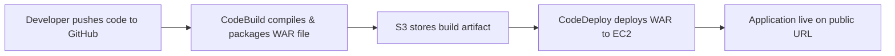

# CI/CD Pipeline for Java Web App on AWS

This project demonstrates how to build a **complete CI/CD pipeline** from scratch to automate the build and deployment of a Java web application using **AWS services**.

It covers everything — from launching a cloud server to deploying the app — with best practices for security, automation, and maintainability.

---

## Tech Stack & AWS Services

* **Java 8 (Amazon Corretto)** — Programming language.
* **Apache Maven** — Build automation tool.
* **AWS EC2** — Cloud server to host and run the app.
* **AWS IAM** — Secure access control.
* **AWS CodeArtifact** — Secure package repository.
* **AWS CodeBuild** — Automated builds.
* **AWS CodeDeploy** — Automated deployments.
* **AWS S3** — Stores build artifacts.
* **AWS CloudFormation** — Infrastructure as Code.
* **Git & GitHub** — Version control.

---

## CI/CD Pipeline Overview



---

# Step-by-Step Guide

## Part 1 — Launch and Prepare Your EC2 Instance for DevOps

### 1. Log in with IAM User

Sign in to AWS using your **IAM user** (not the root account).

### 2. Launch EC2 Instance

* Create an EC2 instance named **devops-`yourname`**.
* Create a key pair named **devops-keypair** and download the `.pem` file.
* Store the `.pem` file in a safe folder.

### 3. Configure Security & Permissions

```bash
chmod 400 path/to/devops-keypair.pem
```

### 4. Connect to EC2

```bash
ssh -i path/to/devops-keypair.pem ec2-user@YOUR_PUBLIC_IPV4_DNS
```

### 5. Install Apache Maven

```bash
wget https://archive.apache.org/dist/maven/maven-3/3.5.2/binaries/apache-maven-3.5.2-bin.tar.gz
sudo tar -xzf apache-maven-3.5.2-bin.tar.gz -C /opt
echo "export PATH=/opt/apache-maven-3.5.2/bin:$PATH" >> ~/.bashrc
source ~/.bashrc
```

### 6. Install Amazon Corretto 8 (Java)

```bash
sudo dnf install -y java-1.8.0-amazon-corretto-devel
export JAVA_HOME=/usr/lib/jvm/java-1.8.0-amazon-corretto.x86_64
export PATH=$JAVA_HOME/jre/bin:$PATH
```

### 7. Create Java Web App

```bash
mvn archetype:generate \
   -DgroupId=com.devops.app \
   -DartifactId=devops-web-project \
   -DarchetypeArtifactId=maven-archetype-webapp \
   -DinteractiveMode=false
```

---

## Part 2 — Set Up Git and Connect to GitHub

### 1. Install Git

```bash
sudo dnf install -y git
```

### 2. Create GitHub Repo

Make a new GitHub repository (e.g., `devops-web-project`).

### 3. Initialize Local Git Repo

```bash
cd devops-web-project
git init
```

### 4. Connect to GitHub

```bash
git remote add origin https://github.com/USERNAME/devops-web-project.git
```

### 5. Create Personal Access Token

* Go to **GitHub → Settings → Developer settings → Tokens (classic)**.
* Select `repo` scope and save your token.

### 6. Configure Git Identity

```bash
git config --global user.name "Your Name"
git config --global user.email "you@example.com"
```

### 7. Commit & Push

```bash
git add .
git commit -m "Initial commit"
git push -u origin main
```

---

## Part 3 — Set Up AWS CodeArtifact Repository

### 1. Create CodeArtifact Repo

In the **AWS Management Console**, go to **CodeArtifact** → **Repositories** → **Create repository**.
* Name: `yourname`-devops-cicd`
* Domain: `yourname`-devops`
* Upstream: **maven-central-store**

### 2. Create IAM Policy for Access

In **IAM**, go to **Policies** → **Create policy** → **JSON**.
(See [full IAM policy JSON here](./policies/CodeArtifact-policy.json))
* Name: codeartifact-`yourname`-consumer-policy

### 3. Attach Policy to EC2 Role

In **IAM** → **Roles** → **Create role** → **AWS service** → **EC2**
* Create IAM role for EC2 with the policy.
* Attach it to your EC2 instance.
* Name: EC2-instance-`yourname`-cicd

In **EC2**, select your instance → **Actions** → **Security** → **Modify IAM role** → attach the role.

### 4. Connect Maven to CodeArtifact

* Use **connection instructions** from CodeArtifact console.
* Copy the **authorization token export command** (Step 3) and run it in your EC2 CLI.
* Create a `settings.xml` file in your project root and paste the XML snippets from Steps 4–6 of the connection instructions (servers, profiles, mirrors)..

### 5. Verify

```bash
mvn -s settings.xml compile
```

---

## Part 4 — Build and Store Artifacts with AWS CodeBuild

### 1. Create S3 Bucket for Artifacts

Name: `yourname-devops-cicd`
Region: Same as other AWS resources.


### 2. Create CodeBuild Project

* Source: GitHub repository.
* Environment: Amazon Linux 2023 + Corretto 8.
* Build specifications: Use `buildspec.yml` from source.
* Artifacts: Amazon S3.

### 3. Add `buildspec.yml`

(See [full buildspec.yml here](./buildspec.yml))

### 4. Run Build

Verify build success in CodeBuild logs and S3.

---

## Part 5 — Deploy Web App with AWS CodeDeploy

### 1. Launch EC2 with CloudFormation

1. Go to **CloudFormation** → **Create stack** → **With new resources (standard)**.

2. **Upload EC2 template (`.yaml` or `.json`)**.

3. **Set Parameters**:

*KeyPair (for SSH access)

*Instance type (e.g., t2.micro)

*VPC/Subnet IDs to match your network setup

4. **Security Group**:

*Allow inbound HTTP (80), HTTPS (443)

*Allow SSH (22) if you need admin access

5. Wait for **CREATE_COMPLETE** and confirm in EC2 console.

### 2. Prepare Deployment Scripts

In your repository, create:

`scripts/install_dependencies.sh`
(See [full install_dependencies.sh here](./scripts/install_dependencies.sh))

`scripts/start_server.sh`
(See [full start_server here](./scripts/start_server.sh))

`scripts/stop_server.sh`
(See [full stop_server here](./scripts/stop_server.sh))

### 3. Create `appspec.yml`

In your repository root:
(See [full appspec.yml here](./appspec.yml))

### 4. Set Up CodeDeploy

1. **Create Application**:
* Name: `yourname`-devops-cicd

*Platform: EC2/On-premises

2. **Create Deployment Group**:

* Name: `yourname`-devops-cicd-deploymentgroup

* Service Role: IAM role with AWSCodeDeployRole policy

* Environment: Select EC2 instances by tag (e.g., Project=DevOpsCICD)

* Agent: Must be installed and running on EC2

### 5. Deploy the Application

1. **In CodeDeploy → Create deployment**:

* Application name: devops-devops-cicd-app

* Deployment group: devops-devops-cicd-deploy-group

* Revision type: Amazon S3

* Bucket: devops-devops-cicd-artifacts

* Object key: build-output.zip (from Part 4)

2. **Start deployment**.

3. **Monitor logs under View Events → Lifecycle events**.

### 6. Verify Deployment

In a browser, visit:

```bash
http://<EC2-Public-DNS>
```


Confirm the app is running and accessible.

**If HTTPS is required**:

*Add inbound rule for port **443** in EC2’s security group.

*Configure SSL in Apache or Tomcat.

---

## 6. Set Up AWS CodePipeline (CI/CD Automation)

### 1. Open CodePipeline

   In the AWS Console, go to CodePipeline.

   Click Create pipeline.

### 2. Pipeline Settings

   Pipeline name: devops-cicd-pipeline

   Service role: Create new or use existing IAM role with full access to CodeCommit, CodeBuild, S3, and CodeDeploy.

   Artifact store: Choose the S3 bucket used in Part 4 (e.g., devops-devops-cicd-artifacts).

   Click Next.

### 3. Add Source Stage

   Source provider: CodeCommit

   Repository name: Your CodeCommit repo 
   
   Branch name: main

   Output artifact: SourceArtifact

   Click Next.

### 4. Add Build Stage

   Build provider: CodeBuild

   Project name: Select your build project (created in Part 4).

   Input artifact: SourceArtifact

   Output artifact: BuildArtifact

Click Next.

### 5. Add Deploy Stage

Deploy provider: CodeDeploy

Application name: `yourname`-devops-cicd (from Part 5)

Deployment group: devops-devops-cicd-deploy-group (from Part 5)

Input artifact: BuildArtifact

Click Next.

### 6. Review and Create Pipeline

Review all stages: Source → Build → Deploy

Click Create pipeline.

The first run will start automatically.


### 7. Verify the Pipeline

In CodePipeline, watch the progress through Source → Build → Deploy.

If successful, go to your browser:

http://`<EC2-Public-DNS>`


and confirm the app is live.

Try making a small change in your CodeCommit repo → push → pipeline should trigger automatically → app redeployed.
   
 
---

## Result

You now have a **fully automated CI/CD pipeline**:

1. **Code changes** pushed to GitHub trigger CodeBuild.
2. CodeBuild compiles & stores artifacts in S3.
3. CodeDeploy deploys the new version to EC2 automatically.

---

## Repository Structure

```css
devops-web-project/
├── pom.xml
├── buildspec.yml
├── appspec.yml
├── scripts/
│   ├── install_dependencies.sh
│   ├── start_server.sh
│   └── stop_server.sh
├── policies/
│   └── CodeArtifact-policy.json
└── src/
    └── main/
        └── webapp/
            ├── WEB-INF/
            │   └── web.xml  
            └── index.jsp  
```

